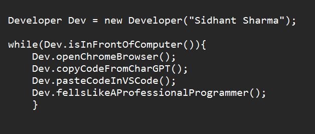

<!-- Greeting -->
# Hey there! :wave::smiley:

<!--Introduction -->
I'm Sidhant Sharma! I'm a student , learning and growing my knowledege in coding. I'm passionate learning new things, creating software:computer: and tools to help people, and **building a community**. Do :star2: my repository if you find my project interesting, at least your star could make someone's day:pray:.
 
 <em><b>I love connecting with different people</b> so if you want to say <b>hi, I'll be happy to meet you more!</b> :blush:</em>

<!-- Your badges -->

<!-- Profile View Count -->

<!-- Working GIF -->

### 💼  Things that I'm currently working on: 
* Learning Web💻: Development
* Learning Mobile Application📱: Development
* Solving DSA questions on LeetCode💻:
* Looking forward to learn new things📲: in future.
* 🔜

### 🌱 Challenges that I’m currently challenging myself:
Since i am a student,I try to learn as much as i can in my spare time, I decided to take this time focusing on feeding more knowledge:books: to myself. I set a couple of self-challenges in order to push myself more further.:running: 

* Solving DSA👨‍💻: 1-2 hours a day with no distraction ( One or two day off a week. ) 
* Read📰: Dev and UI articles daily 
* Workout🏋️‍♂️: 6 days in a row and take a day break 
* Avoid spending too much time on Youtube Entertainment☠️
* Adapting the minimalism life style
* 🔜

 ### Languages and Tools: 

 <!-- GitHub README Stats -->
  <a href="https://github.com/IceBerG-15?tab=repositories">
    
   <!-- 
NOTE: Top languages does not indicate my skill level or something like that, it's a github metric of which languages i have the most code on github. -->
  </a>
 <!-- icons -->
<code></code>
<code></code>
<code></code>
 
<code></code>
<code></code>
<code></code>
<code></code>
 
<code></code>
<code></code>
<code></code>
 
<code></code>
<code></code>
<code></code>
<code></code>
<code></code>
 

<h4 align="center"> Thanks for Visiting! :innocent:</h4>

:star: From [Sidhant Sharma](https://github.com/IceBerG-15)

